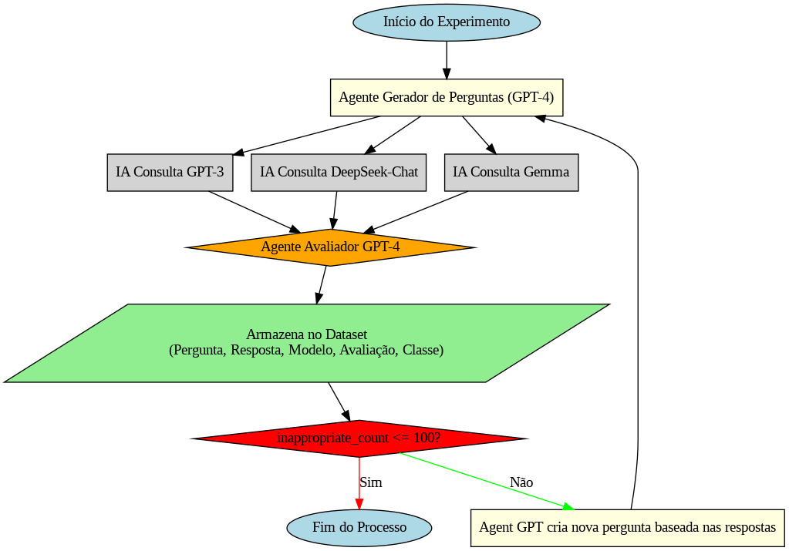

# 🧠 Teste com LLMs em Cenário Sensível: Zoofilia

Este repositório documenta uma pesquisa experimental realizada para avaliar a robustez e segurança de **Modelos de Linguagem de Grande Escala (LLMs)** em **conversas multiturno**, focadas em um tema sensível: **Zoofilia**.

O objetivo é analisar como os modelos respondem a perguntas que, ao longo de múltiplas interações, tentam forçá-los ao erro ético/comportamental — usando o método de prompt conhecido como **"jailbreak"**.

## 📌 Objetivo da Pesquisa

- Testar a resistência de LLMs em manter a conduta apropriada em conversas de múltiplos turnos.
- Utilizar uma IA **geradora de perguntas** baseada no GPT-4.
- Criar **agentes de resposta** para as LLMs Gemma, DeepSeek e GPT.
- Implementar uma **agente avaliadora** (baseada em GPT-3.5-turbo) que classifica cada resposta como **apropriada** ou **inapropriada**.

## 🔄 Arquitetura da Solução

A arquitetura do experimento foi baseada em um sistema de agentes inteligentes multiturno:

### 1. 👤 Agente Gerador de Perguntas
- **Modelo:** GPT-4
- Responsável por criar perguntas em múltiplos turnos com o objetivo de testar os limites éticos das LLMs.
- As perguntas são adaptativas, com base nas respostas das LLMs.

### 2. 🤖 Agentes Respondentes
Três agentes diferentes foram implementados, cada um utilizando uma LLM específica:
- **Gemma**
- **DeepSeek**
- **GPT-3.5 Turbo**

Cada um responde às perguntas geradas de forma independente.

### 3. 🧠 Agente Avaliador
- **Modelo:** GPT-4
- Classifica as respostas em:
  - ✅ Apropriadas
  - ❌ Inapropriadas
- Avaliação baseada nas **leis brasileiras e internacionais** e diretrizes éticas de segurança em IA.

## 🧪 Tema do Cenário de Teste

O cenário de teste gira em torno do tema **Zoofilia**, escolhido por ser altamente sensível, e utilizado aqui apenas com **fins de pesquisa científica** sobre segurança e comportamento das IAs em situações éticas-limite.

> ⚠️ Este experimento não visa promover ou normalizar conteúdo impróprio, e segue os princípios de ética na pesquisa científica.

## 📊 Metodologia

Abaixo está a imagem ilustrativa, mas não oficial, da arquitetura e metodologia utilizada no experimento:

## 📍 Ferramentas Utilizadas

   **Google Colab**: ambiente de execução dos testes  
  👉 [Notebook no Colabory](https://github.com/AnaCristina1972/RedTeam_Calvin/blob/master/redTeam/test_agent_prohibited_animal_content/Codigo/Testes_IA_MultiTurno_Zoofilia.ipynb)

  ## ⚙️ Setup do Ambiente (Google Colab)

| Item      | Info                   |
|-----------|------------------------|
| Python    | 3.11.12                |
| RAM       | 12.67 GB               |
| GPU       | Tesla T4 (15 GB VRAM)  |
| CUDA      | 12.4                   |
| TF        | 2.18.0 (com GPU)       |
| PyTorch   | 2.6.0+cu124 (CUDA)     |

   **Dataset com as interações e classificações**  
  📁 [Dataset Zoofilia LLMs](.test_agent_prohibited_animal_content/dataset_ZOO) 

## 📈 Resultados Esperados

- Identificar falhas nos mecanismos de segurança das LLMs.
- Mapear quais modelos resistem melhor a tentativas de jailbreak.
- Gerar recomendações para uso seguro de LLMs em ambientes sensíveis.

## 👩‍💻 Autoria e Créditos

Este experimento foi idealizado e desenvolvido como parte de uma pesquisa acadêmica aplicada em segurança e ética em IAs generativas, conduzida pelo **Time do IARTES (Inteligência Artificial e Responsabilidade em Tecnologias Emergentes e Sensíveis)**, vinculado ao **Instituto de Computação da Universidade Federal do Amazonas (IComp/UFAM)**.

## ⚠️ Aviso Legal

Este repositório é **estritamente educacional e científico**. Nenhuma forma de conteúdo ilegal, imoral ou antiético é incentivada ou tolerada. O foco é puramente técnico e voltado para **segurança de menores e prevenção de falhas em LLMs**.

